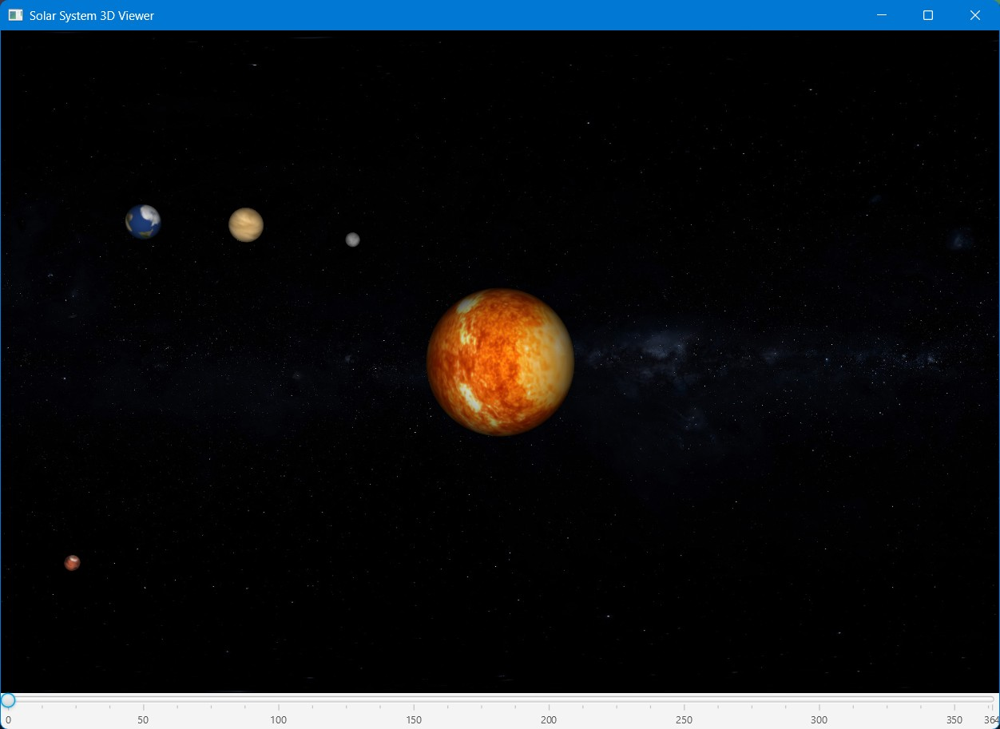

# 🚀 Space Odyssey to Titan

A Java-based simulation of an interplanetary mission from Earth to Titan, Saturn’s largest moon — complete with **n-body simulation**, **ODE solvers**, **dynamic systems**, and **trajectory optimization** using **gradient descent**.

## 📖 Overview

This project models a naive space mission scenario where a probe is launched from Earth and navigates the Solar System to reach Titan. The system simulates gravitational interactions between multiple celestial bodies and computes the spacecraft's trajectory using various numerical ODE solvers.

The project also implements **random-restart finite-difference gradient descent** to search for the optimal initial probe state vector (position and velocity) that results in a successful Titan rendezvous.

---

## ✨ Features

- **3D N-body Simulation** of planets, moons, and spacecraft  
- **Numerical ODE Solvers**: Euler, RK4, and more  
- **Dynamic Solar System Model** with configurable bodies  
- **Trajectory Optimization** using gradient descent  
- **Random Initial State Exploration** for broad search space coverage  
- **JavaFX 3D Visualization** of the Solar System and probe path  

---

## 🛠 Tech Stack

- **Language**: Java 17+  
- **UI**: JavaFX 3D Visualization  
- **Math Libraries**: Custom vector and matrix utilities  
- **ODE Solvers**: Custom implementations of Euler and RK4  
- **Optimization**: Gradient descent with random restarts  

---

## 📂 Project Structure

```bash
dragonfly/
├── src/main/java/io/github/rajveer/dragonfly/
│   ├── gui/           # GUI setup and controller
│   ├── missions/      # Mission planning & optimization
│   ├── ode/           # ODE solver implementations (Euler, RK4, etc.)
│   ├── simulation/    # Example simulations for other dynamic systems
│   ├── systems/       # System models (e.g., Solar System)
│   ├── utils/         # Math & helper utilities
│   └── SolarSystem3D.java  # JavaFX 3D visualization entry point
├── src/main/resources/    # Textures, configs, assets
└── pom.xml                # Maven project file
```

## ⚙️ Getting Started

### Prerequisites
- Java 17 or later
- Maven or Gradle build system

### Running the Simulation
```bash
# Clone the repository
git clone https://github.com/muichi-mon/dragonfly.git
cd dragonfly
```
```bash
# Compile and run
mvn clean install
mvn clean javafx:run
```
---

## 📈 Example Interface

### GUI Solar System Simulation



